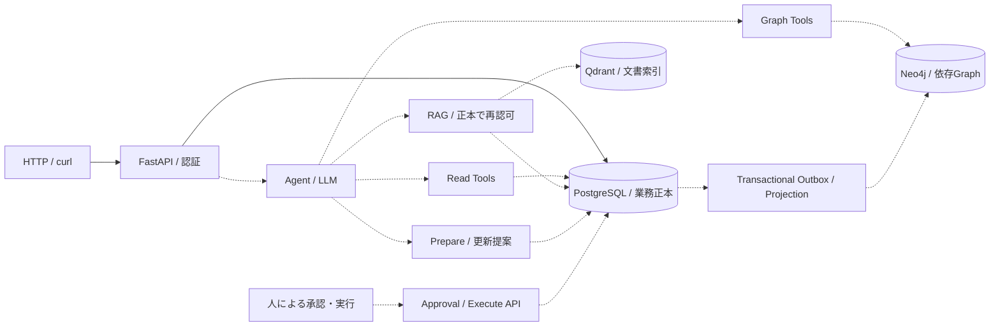

# LineScope

[](https://github.com/philippos2/line-scope/actions/workflows/ci.yml)

**製造現場の業務Object・依存Graph・文書Evidence・承認付きActionをつなぐプロダクト。**

設備・工程・生産作業・製品・インフラの関係から、停止時の影響や依存先を調べ、根拠を確認して業務更新へ進めるシステムを目指しています。AIは調査と更新提案を支援し、承認と実行は認証済みの人が操作します。

> **現在はバックエンドを段階的に開発中です。** PostgreSQLの業務スキーマ、内部Read Tools、更新提案のSnapshot構築・検証と内部保存・再送処理まで実装しています。HTTPから試せるのは認証付きhealth / readinessです。Agent・承認・実行・Graph・RAGの接続は後続工程です。

## 主な機能と実装状況

| 領域 | 現在の状態 |
|---|---|
| API基盤 | FastAPI、Bearer認証、Trusted Execution Context、共通Response Envelopeを実装 |
| PostgreSQL | 業務10テーブルと更新要求・Target・承認の3テーブル、DB制約、checksum付きmigrationを実装 |
| 正本参照 | ID参照・設備割当参照・検索の内部Read Tool 13種を実装 |
| 更新提案 | 設備状態、保全予定・実績、生産作業の予定値・設備割当、依存関係のCanonical Snapshotを構築・検証 |
| Prepare / Approval / Execute | Snapshot・Target・PENDING承認の内部保存、カテゴリ別要求権限、retry key再送を実装。正本取得・Prepare統合・承認／実行処理は後続 |
| Graph / Outbox | Neo4j Projection、同期管理、依存・影響分析は後続 |
| RAG / Agent | Qdrant連携とLLM / embedding modelの評価・選定は後続 |
| Frontend | サーバサイド完成後に構築。Graph中心のオペレーション画面は候補の一つ |

Snapshotは提案内容を固定するためのデータです。構築できることと、承認済み・実行済みであることは別です。設備状態・更新履歴の参照も後続工程です。

## システム構成とデータの正本

設計上の全体構成です。実線は現在のAPIとPostgreSQL、点線は後続で接続する機能を示します。



| 層 | 技術・責務 |
|---|---|
| Backend | Python / FastAPI / Uvicorn、Psycopg 3 |
| 正本DB | PostgreSQL。業務データ・更新要求・承認・履歴・Outboxを保持 |
| 依存Graph | Neo4j。PostgreSQLから再構築可能な派生Read Model |
| 文書検索 | Qdrant。再生成可能な派生Vector Index |
| 実行・検証 | Docker Compose、pytest、Ruff、GitHub Actions |

Graph分析は同期状態CURRENTのときだけ正常利用します。設備状態などの現在値はPostgreSQLで確認します。LLMにApproval / Executeを操作させません。詳細は[アーキテクチャ](docs/design/architecture.md)と[トランザクション設計](docs/implementation-design/transaction-design.md)を参照してください。

## DBスキーマ・ER図

設備を中心に、保全予定・実績と、生産作業の複数設備割当を管理します。Product・InfrastructureResourceなどとの依存関係は、型付きのDependencyRelationで表します。

**[適用済み10テーブルのER図とデータ設計](docs/design/data-model.md#13-適用済み業務スキーマのer図)**

ER図はSQLのFKを示します。DependencyRelationの多態的な参照やNeo4jの探索方向は、[ドメインモデル](docs/requirements/domain-model.md)を正とします。

## 起動する

Docker Engine、Docker Compose v2、資格情報生成用のPython 3を用意します。API・migrationはPython 3.14.4の非rootコンテナ、PostgreSQLは18.6で動作します。

```sh
git clone https://github.com/philippos2/line-scope.git
cd line-scope
python3 scripts/create_demo_env.py
docker compose up --build -d --wait api
```

PostgreSQLのhealthcheck後にmigrationを適用し、その成功後にAPIを起動します。現在はスキーマを作成するまでで、デモ用業務データのseedは未実装です。

資格情報はGit管理外の`.env`へ権限600で生成します。既存`.env`は上書きしないので、作成済みなら生成コマンドを省略してください。各ロール1名と工場管理者2名の資格情報を生成します。

APIは`127.0.0.1:8000`、DB portはホストに公開しません。API portは`.env`の`LINESCOPE_API_PORT`で変更できます。

## curlで確認する

`.env`の`LINESCOPE_USERS`は「Bearer token → user_id / role」のJSONです。生成済みtokenを下の変数へ設定します。実際のtokenをGitへ保存しないでください。

```sh
LINESCOPE_TOKEN='<.envにあるBearer token>'
BASE_URL='http://127.0.0.1:8000'

curl -sS -i "$BASE_URL/health" \
  -H "Authorization: Bearer $LINESCOPE_TOKEN"

curl -sS -i "$BASE_URL/health/ready" \
  -H "Authorization: Bearer $LINESCOPE_TOKEN"
```

両方とも正常時はHTTP 200です。共通Envelopeの`status`は`ok`、`data`はそれぞれ次の内容になります。`request_id`は呼出しごとにサーバが生成します。

```json
{"service":"linescope","alive":true}
```

```json
{"service":"linescope","postgresql":"available"}
```

認証なしの呼出しはHTTP 401、`errors[0].code`は`AUTHENTICATION_REQUIRED`になります。

```sh
curl -sS -i "$BASE_URL/health"
unset LINESCOPE_TOKEN
```

readinessでPostgreSQLへ接続できなければHTTP 503、`DEPENDENCY_UNAVAILABLE`です。Graph・RAG・業務APIの準備完了を表すものではありません。`POST /agent`や更新APIのcurl例は、そのAPIの実装時に追加します。

## 内部Toolsと更新提案

現在のRead ToolsはPythonの内部呼出しで、HTTP endpointとしては公開していません。

| Tool | 動作 |
|---|---|
| `get_equipment` / `get_equipment_state` | 設備と現在状態をID参照 |
| `get_maintenance_plan` | 保全予定をID参照 |
| `get_process` / `get_production_operation` | 工程・生産作業をID参照 |
| `get_product` / `get_infrastructure_resource` / `get_dependency_relation` | 製品・インフラ・依存関係をID参照 |
| `get_operation_equipment_assignments` | 生産作業のactive設備割当と親versionを同じstatementで参照 |
| `search_equipment` / `search_maintenance_plans` / `search_maintenance_records` / `search_dependency_relations` | 条件検索と署名cursorによるページング |

参照はREAD COMMITTED / READ ONLYで実行し、正本recordと構造化Evidenceを返します。過去時刻の割当参照は現在登録情報の期間評価であり、当時の状態の完全復元ではありません。

`linescope.snapshot`はCanonical JSON / SHA-256、型・業務値・version・Targetの整合を検証します。設備割当は明示した半開期間だけを置換し、期間外を保持します。予定値と割当の同時変更でも親versionの増分は1です。[API / Tool契約](docs/implementation-design/api-tools.md)、[Snapshotの保存形式](docs/design/data-model.md)、[期間置換の業務ルール](docs/requirements/domain-model.md#152-equipment集合変更)を参照してください。

## テストとCI

Docker内で実PostgreSQLを使って検証します。テスト用Composeは独立したproject・tmpfsを使い、デモの資格情報や永続volumeを共有しません。

```sh
docker compose -f compose.test.yaml build tests
docker compose -f compose.test.yaml run --rm --no-deps tests ruff check backend scripts
docker compose -f compose.test.yaml run --rm --no-deps tests ruff format --check backend scripts
docker compose -f compose.test.yaml run --rm tests
docker compose -f compose.test.yaml down --volumes --remove-orphans
```

CIも同じ経路でlint・format・全テストを実行し、実行用imageの起動と同梱migrationを確認します。mainへの反映には`Tests and migrations`と`PR title`の成功を必須とし、人が確認してSquash mergeします。[開発・PR運用](CONTRIBUTING.md)を参照してください。

## 停止・再起動と開発

```sh
docker compose logs api
docker compose run --rm migrate
docker compose down
```

通常の`down`はDB volumeを保持します。通常停止時に`--volumes`を付けないでください。`.env`のDBパスワードを書き換えても、既存volumeのパスワードは自動更新されません。migrationは適用後のchecksum変更を拒否し、再実行では適用済みSQLをskipします。

```text
line-scope/
├── backend/       # Python package・SQL migrations・tests・依存lock
├── frontend/      # 後続UIの配置先（現在は案内のみ）
├── docs/          # 要件・設計・実装設計、変更履歴
├── scripts/       # デモ資格情報生成・コンテナhealthcheck
├── compose.yaml
└── compose.test.yaml
```

標準実行・検証経路はDockerです。ホストでの補助的な開発、設定・依存lock・volume管理の詳細は[運用手順](docs/implementation-design/operations.md#11-backend基盤チェックポイント)を参照してください。

## 設計・検証資料

- [19文書の成果物一覧・各文書の責務](docs/deliverables.md)
- [要件とスコープ](docs/requirements/requirements.md)
- [業務モデル・Graph意味論](docs/requirements/domain-model.md)
- [権限・承認](docs/requirements/access-control.md)
- [アーキテクチャ](docs/design/architecture.md)
- [DB・Graphデータ設計とER図](docs/design/data-model.md)
- [API / Tool契約](docs/implementation-design/api-tools.md)
- [トランザクション・Outbox・同期](docs/implementation-design/transaction-design.md)
- [受入基準](docs/requirements/acceptance-criteria.md)・[テスト計画](docs/implementation-design/test-plan.md)
- [運用手順](docs/implementation-design/operations.md)
- [レビュー・実装チェックポイントの履歴](docs/history/README.md)

現在は単一工場のデモ実装を進めています。性能・実モデルの品質・製品全体の受入完了は、各機能の実装と評価後に確認します。
