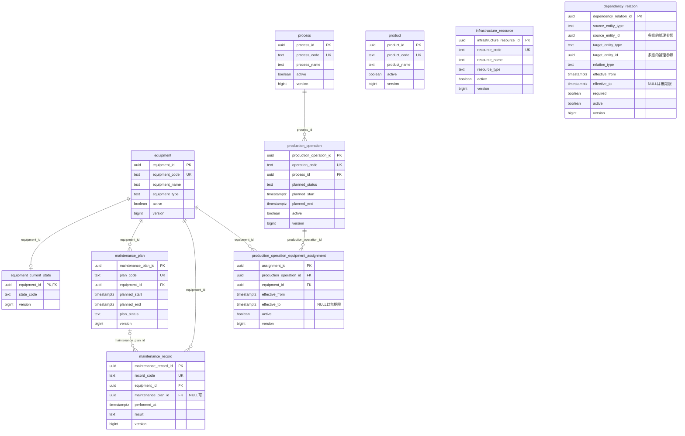

# LineScope データモデル・DB設計書

## 1. PostgreSQL

PostgreSQLをSystem of Recordとする。

## 2. 主要テーブル

### equipment
- equipment_id UUID PK
- equipment_code TEXT UNIQUE NOT NULL
- equipment_name TEXT NOT NULL
- equipment_type TEXT NOT NULL
- version BIGINT NOT NULL
- active BOOLEAN NOT NULL
- created_at / updated_at TIMESTAMPTZ

### equipment_current_state
- equipment_id UUID PK/FK
- state_code TEXT NOT NULL
- version BIGINT NOT NULL
- updated_at TIMESTAMPTZ

### equipment_state_history
- history_id UUID PK
- equipment_id UUID FK
- state_code TEXT NOT NULL
- effective_at TIMESTAMPTZ
- recorded_at TIMESTAMPTZ

### maintenance_plan
- maintenance_plan_id UUID PK
- plan_code TEXT UNIQUE NOT NULL
- equipment_id UUID FK
- planned_start / planned_end TIMESTAMPTZ
- plan_status TEXT
- version BIGINT

### maintenance_record
- maintenance_record_id UUID PK
- record_code TEXT UNIQUE NOT NULL
- maintenance_plan_id UUID NULL FK
- equipment_id UUID FK
- performed_at TIMESTAMPTZ
- result TEXT
- version BIGINT

### process
- process_id UUID PK
- process_code TEXT UNIQUE NOT NULL
- process_name TEXT NOT NULL
- version BIGINT
- active BOOLEAN

### production_operation
- production_operation_id UUID PK
- operation_code TEXT UNIQUE NOT NULL
- process_id UUID FK
- planned_status TEXT
- planned_start / planned_end TIMESTAMPTZ
- version BIGINT
- active BOOLEAN

`assigned_equipment_id` は持たない。

### production_operation_equipment_assignment
- assignment_id UUID PK
- production_operation_id UUID FK
- equipment_id UUID FK
- effective_from TIMESTAMPTZ NOT NULL
- effective_to TIMESTAMPTZ NULL
- active BOOLEAN NOT NULL
- version BIGINT NOT NULL
- created_at / updated_at TIMESTAMPTZ

業務キー: `(production_operation_id, equipment_id, effective_from)`。
同じoperation/equipmentで有効期間が重複するactive割当を拒否する。

### product
- product_id UUID PK
- product_code TEXT UNIQUE NOT NULL
- product_name TEXT NOT NULL
- version BIGINT
- active BOOLEAN

### infrastructure_resource
- infrastructure_resource_id UUID PK
- resource_code TEXT UNIQUE NOT NULL
- resource_name TEXT NOT NULL
- resource_type TEXT NOT NULL
- version BIGINT
- active BOOLEAN

### dependency_relation
- dependency_relation_id UUID PK
- source_entity_type TEXT NOT NULL
- source_entity_id UUID NOT NULL
- target_entity_type TEXT NOT NULL
- target_entity_id UUID NOT NULL
- relation_type TEXT NOT NULL
- effective_from TIMESTAMPTZ NOT NULL
- effective_to TIMESTAMPTZ NULL
- required BOOLEAN NOT NULL
- active BOOLEAN NOT NULL
- version BIGINT NOT NULL
- created_at / updated_at TIMESTAMPTZ

`relation_type='USES'` の直接登録は禁止。
型組合せはdomain-modelの表を検証する。

業務キー: source type/id + target type/id + relation_type + effective_from。
同一論理関係の有効期間重複を業務ルールで拒否する。

### update_request
- update_request_id UUID PK
- requester_id TEXT NOT NULL
- operation_type TEXT NOT NULL
- status TEXT NOT NULL
- idempotency_key UUID UNIQUE NOT NULL
- prepare_retry_key UUID NOT NULL
- prepare_input_hash TEXT NOT NULL
- agent_input_hash TEXT NOT NULL
- canonical_snapshot TEXT NOT NULL
- snapshot_schema_version INTEGER NOT NULL
- snapshot_hash TEXT NOT NULL
- execution_result JSONB NULL
- UNIQUE(requester_id, prepare_retry_key)
- created_at / updated_at TIMESTAMPTZ

idempotency_keyはPrepare受付時にサーバが生成する。UpdateRequest ID自体をExecute冪等性キーとして扱う。

### update_target
- update_target_id UUID PK
- update_request_id UUID FK
- target_type TEXT NOT NULL
- target_id UUID NOT NULL（CREATEもPrepareで生成）
- business_key JSONB NOT NULL
- operation_type TEXT NOT NULL
- before_snapshot JSONB
- proposed_snapshot JSONB NOT NULL
- expected_version BIGINT NULL

### approval
- approval_id UUID PK
- update_request_id UUID UNIQUE NOT NULL FK
- approver_id TEXT NULL
- status TEXT NOT NULL
- snapshot_hash TEXT NOT NULL
- approved_at TIMESTAMPTZ NULL
- expires_at TIMESTAMPTZ NULL
- consumed_at TIMESTAMPTZ NULL
- created_at / updated_at TIMESTAMPTZ

### business_update_history
- history_id UUID PK
- update_request_id UUID UNIQUE NOT NULL
- approval_id UUID NOT NULL
- requester_id TEXT NOT NULL
- approver_id TEXT NOT NULL
- category TEXT NOT NULL
- before_snapshot JSONB
- after_snapshot JSONB
- result TEXT NOT NULL
- occurred_at TIMESTAMPTZ

### graph_outbox
- outbox_id UUID PK
- update_request_id UUID NOT NULL FK
- update_target_id UUID NOT NULL FK
- aggregate_type TEXT NOT NULL
- aggregate_id UUID NOT NULL
- aggregate_version BIGINT NOT NULL
- event_type TEXT NOT NULL
- payload JSONB NOT NULL
- status TEXT NOT NULL
- attempt_count INTEGER NOT NULL
- next_attempt_at TIMESTAMPTZ NULL
- processing_started_at TIMESTAMPTZ NULL
- processed_at TIMESTAMPTZ NULL
- last_error TEXT NULL
- created_at TIMESTAMPTZ NOT NULL

`outbox_id` は順序watermarkとして使用しない。

### knowledge_document
- document_id UUID PK
- document_code TEXT NOT NULL
- document_version BIGINT NOT NULL
- title TEXT NOT NULL
- source_uri TEXT NULL
- access_class TEXT NOT NULL
- active BOOLEAN NOT NULL
- content_hash TEXT NOT NULL
- created_at / updated_at TIMESTAMPTZ
- UNIQUE(document_code, document_version)

## 3. CREATE / UPDATE

CREATE: expected_version NULL。
UPDATE / DISABLE: expected_version必須。

## 4. Neo4jノード

- Equipment
- Process
- ProductionOperation
- Product
- InfrastructureResource

属性:
- entity_id
- entity_version
- source_outbox_id

## 5. Neo4jエッジ

- DEPENDS_ON
- PRECEDES
- SUPPLIES
- CONTROLS
- PRODUCES
- CAN_SUBSTITUTE
- USES

USESはAssignmentから派生する。

属性:
- source_record_id
- source_version
- source_outbox_id
- effective_from / effective_to
- required
- active

Projectionはsource_versionが既存より新しい場合のみ更新する。同version再適用は冪等に成功させる。

## 6. Graph同期

CURRENT判定にglobal ID比較を用いない。

- rebuild flag: REBUILDING（最優先）
- DEADまたはfatal_errorあり: ERROR
- PENDING / PROCESSING / RETRYABLEが1件以上: LAGGING
- 上記なし: CURRENT

## 7. Graph更新ロック

Graph-affecting正本更新は共通transaction-scoped PostgreSQL Advisory Lockを取得する。

DependencyRelationの循環検査、Assignment変更、Graph rebuildの整合境界をこのロックで保護する。

## 8. Neo4j選定

RDB再帰CTEでも実装可能だが、可変長Path、根拠経路、共通依存、代替探索を主要機能として扱うためNeo4jを派生Read Modelとして採用する。

## 9. 制約・監査・同期管理

全更新対象versionはNOT NULL、初期値1、正整数。変更ごとに1増加。非NULL effective_toはeffective_fromより後。AssignmentとDependencyRelationの業務キーをUNIQUEにする。多態的Relation endpointは型・存在・activeをTransactionで検証。期間重複は共通Graph mutation lockで直列化する。

履歴・Approval・Outboxの関連IDはFK。OutboxはUNIQUE(aggregate_type, aggregate_id, aggregate_version)。statusは列挙値制約、遷移はtransaction-designに従う。成功履歴は一要求につき1件。Snapshot / Targetは保存後不変、execution_resultはCOMPLETED時に保存。

### update_audit_event

- audit_event_id UUID PK
- request_id UUID NOT NULL
- update_request_id UUID NOT NULL FK
- approval_id UUID NULL FK
- actor_id TEXT NOT NULL
- action TEXT NOT NULL（PREPARE / APPROVE / REJECT / EXECUTE / INVALIDATE / EXPIRE / FAILURE / PROJECTION）
- before_status / after_status TEXT NULL
- result_code TEXT NOT NULL
- details JSONB NOT NULL（Target、Outbox ID、試行番号等。秘密情報を含めない）
- occurred_at TIMESTAMPTZ NOT NULL

成功変更と監査は同一Transaction。rollbackした失敗試行は別Transactionで監査し成功履歴と区別する。PostgreSQL不可ならrequest_id付き運用ログに記録し監査保存失敗を明示。監査閲覧も要求の閲覧境界を守る。workerのactor_idは内部サービス主体。

### graph_projection_control

単一工場singleton row。

- control_id INTEGER PK（固定値1）
- rebuild_flag BOOLEAN NOT NULL
- rebuild_id UUID NULL
- active_generation UUID NULL
- fatal_error TEXT NULL
- updated_at TIMESTAMPTZ NOT NULL

初期状態はactive_generation=NULL、fatal_error=NOT_INITIALIZED。Outboxが空でも初期化前はCURRENTにしない。seed後RebuildでGraphを検証・公開。heartbeatは運用監視用であり単なるworker停止と重大障害を同一視しない。

## 10. Neo4j Projection識別

全ノード・エッジにgenerationを付与し、Toolはactive_generationのみ参照。ノード識別子は(generation, entity_type, entity_id)。Projection markerは(generation, aggregate_type, aggregate_id)の一意制約を持ち、source_version、payload_hash、source_outbox_idを保持する。

markerへのwrite lock取得後、version比較・旧エッジ除去・新エッジ生成・marker更新を単一Neo4j Transactionで行う。endpoint / type変更でもsource_record_idで旧エッジを除去。DISABLEはactive=falseを保持しmarkerを削除しない。USESのsource_record_idはassignment_id。端点ノードは正本seed / Rebuildから作成し、不存在を推測生成しない。

Rebuildはactive=falseを含む全Relation / Assignmentとmarkerを投影し古い再送に耐える。ノードactiveも正本から保持する。探索はactiveノード、activeかつ時刻有効なエッジに限定。過去as_ofはdomain-model §15.3の現在登録情報評価に限定する。

## 11. KnowledgeDocument制約

同一document_codeのactive行は最大1件（active=trueの部分UNIQUE）。新versionは既存最大より大きくし、metadata有効化時に旧versionを同一Transactionでinactiveにする。本文はversionごとに不変の管理対象ファイルをsource_uriで識別し、content_hashは元本文byte列のSHA-256。access_classはFACTORY_INTERNALのみ。

## 12. 型・Snapshot・payloadの補足

UpdateTarget target_typeはEquipmentState / MaintenancePlan / MaintenanceRecord / ProductionOperation / ProductionOperationEquipmentAssignment / DependencyRelation。EquipmentStateのtarget_idはequipment_idであり、equipment_current_state.versionを競合対象にする。Equipment本体versionではない。update_request.operation_typeは単一操作ならCREATE / UPDATE / DISABLE、複合ならCOMPOSITE。各Targetのoperation_typeが具体的な操作を表す。カテゴリはTarget型から一意に導出しhistory.categoryに保存する。

Equipment状態履歴にはupdate_request_id UUID NOT NULL FKを付け、一要求内複数設備の追跡を可能にする。状態履歴effective_at / recorded_atと現在状態updated_atは実行サーバ時刻。Snapshotのbefore / afterはこれら監査時刻を除いた業務項目・versionで比較する。

Assignment区間差分は業務キー一致の既存行を再利用し、一意制約に反する同キーCREATEを行わない。Snapshotはinactive一致行を含む変更前値・expected_versionも保存する。

割当置換を含むProductionOperation Targetは、before / afterの全親業務項目にequipment_assignments配列を追加する形状とする。両側とも当該親の全active Assignmentの全業務項目・versionをassignment_id順で保存し、監査時刻は除外する。空集合は[]でありNULLではない。変更するAssignmentは別Targetに列挙し、inactive行再利用のbeforeはそのTargetに保存する。予定値だけのTargetは既存の親業務項目のみの形状を使用し、割当Targetを付けない。

DependencyRelation Targetのbusiness_keyはafterのsource型・ID / target型・ID / relation_type / effective_fromから構成する。UPDATEで業務キーを変更した場合、旧キーはbeforeに保持する。Snapshot内の業務キー重複はafterキーで検証し、正本の未変更行を含む最終集合の一意性・期間重複・循環はPrepare / Executeで検証する。

Outbox payloadはschema_version、aggregate_type、aggregate_id、aggregate_version、完全なstateを含む。payload_hashはgeneration / source_outbox_id等の配送メタデータを除くcanonical投影状態から計算し、Rebuild時も同じ形式を使う。Neo4j node.entity_versionは生成・Rebuild時の正本出所versionであり、現在の業務状態versionとして利用しない。v1の変更可能な予定値はGraphへ複製しないため、必要な現在versionはPostgreSQLで確認する。エッジsource_versionはaggregateのProjection競合を防ぐversionとして用いる。

Graph業務キーUNIQUEはDEFERRABLE INITIALLY IMMEDIATEとする。複数Relationの業務キー変更を伴う更新はTransaction内で該当制約をDEFERREDにし、最終集合の一意性を検証する。PKとOutbox・Prepareの冪等性UNIQUEは即時制約のまま。業務必須項目・状態値はrequirements §12に従いNOT NULL / CHECK制約で防御する。

Neo4j generation markerはgeneration、validated BOOLEAN、snapshot_hash、validated_atを持つ。Rebuildは全投影検証後にvalidated=trueを保存してからPostgreSQL active_generationを切り替える。生成途中のmarkerはvalidated=false。Graph Toolはactive_generationのvalidated marker存在を確認する。

## 13. 適用済み業務スキーマのER図

以下はmigration `002_business_schema.sql`で適用済みの業務10テーブルを示す。migration管理用の`schema_migration`は含めない。更新要求・Target・Approvalの3テーブルはmigration `003_update_request_schema.sql`で適用済みだが、この業務ER図には含めない。equipment_state_history、履歴、Outbox、KnowledgeDocumentのDB実装は後続工程。

監査時刻は図を簡潔にするため省略した。全列・制約の実装は[SQL migration](../../backend/src/linescope/migrations/002_business_schema.sql)を参照する。Assignmentの業務キーはproduction_operation_id / equipment_id / effective_from、DependencyRelationはsource型・ID / target型・ID / relation_type / effective_fromの複合一意である。

線はSQLのFKだけを表す。DependencyRelationのsource / targetは通常のFKではなく、Equipment・Process・ProductionOperation・Product・InfrastructureResourceへの型付き論理参照であり、参照先の存在・activeや混在循環等は後続の更新Transactionで検証する。図のProduct・InfrastructureResourceがFK線を持たないことは、業務上の依存関係がないことを意味しない。依存の保存方向・影響方向・Neo4j Projectionはdomain-modelと本書§4〜6を正とする。

maintenance_plan_idのNULLは計画との関連なしを表す。計画を指定した実績のequipment_id一致、active期間重複などの業務制約は、単独のFKとは別に更新Transactionで検証する。

## 14. 業務判断支援で必要なデータ拡張（未確定）

現在の主要テーブルは能力・経済・安全・故障分析の全入力を保持しない。requirements §14.2のA / B / C分類を正とする。追加要件を対象外にはしないが、未決定のテーブル・列・DEFAULT・値域を既存ER図へ実装済みとして追加しない。

拡張の設計入力は、製品・期間別の能力／負荷／必要量、通貨・適用期間付き損失率、稼働calendar、修理／交換案の費用・時間・lead time、計画種別、劣化観測、適用安全基準と判定根拠、故障／修理／過去停止影響、buffer・納期である。意味・登録主体・権限はPO-B01〜07で確定する。

計算入力にはsource object / record、version、観測時刻、適用期間、単位、推定／確定の区別を追跡可能にする。欠損値を0やFALSEで初期化しない。MaintenanceRecord.resultや文書citationは説明根拠として使えても、定義済み数値列・安全判定ルールを自動代替しない。新数量のscale・丸め・保存型は意味確定後に定義する。既存canonical Snapshot v1のdecimal / float拒否は維持し、必要なら明示した新schemaを設計する。

## 15. ログと業務監査の責務

運用JSONログの契約はoperations §13。update_audit_event / business_update_history / Outbox / controlをstdoutで代替しない。監査detailsは関連Target・Outbox ID・試行番号・固定理由code等に限定し、Snapshot全文・credential・本文を重複保存しない。変更前後は保存Snapshot・成功履歴へ関連付ける。既存監査表の構造・Transaction境界は§9を維持し、今回の設計追記でmigration実装済みとは扱わない。
